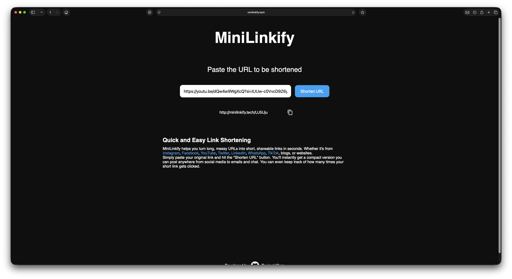

# Minilinkify URL Shortener


Minilinkify is a lightweight, production-ready URL shortening service built using **Spring Boot**, **PostgreSQL**, and **Docker**. Originally deployed on **AWS EC2**, it's currently running on **Google Cloud Run** due to limited EC2 credits.

**Live link**: [https://minilinkify.tech/](https://minilinkify.tech/)

(might take a bit to load because google run shuts it down due to inactivity)

---

## Features

- Shorten any valid URL
- Redirect users via `/{shortCode}`
- Track click count and creation date
- Delete shortened URLs
- RESTful API with JSON
- Fully containerized (Docker + Compose)
- Deployable on any cloud VM (EC2 used here)

---

## Tech Stack

**Backend**:
- Spring Boot 3.5
- Spring Data JPA + Hibernate
- PostgreSQL
- HikariCP

**Frontend**:
- HTML, CSS, JavaScript
- `fetch()` API
- Clipboard API (with fallback)

**DevOps**:
- Docker
- Docker Compose
- AWS EC2

---

## Local Setup

### Requirements

- Docker + Docker Compose installed

### Clone the Repo

```bash
git clone https://github.com/your-username/minilinkify-url-api.git
cd minilinkify-url-api

## Run with Docker Compose

docker-compose up --build
````

This command will:

* Build the application image
* Launch both the Spring Boot application and PostgreSQL container

---

## API Endpoints

| Method | Endpoint              | Description                 |
| ------ | --------------------- | --------------------------- |
| POST   | `/shorten`            | Create a new short URL      |
| GET    | `/{shortCode}`        | Redirect to original URL    |
| GET    | `/{shortCode}/stats`  | Get stats for the short URL |
| DELETE | `/{shortCode}/delete` | Delete the short URL        |

---

## Deployment on AWS EC2

1. Launch an EC2 instance with **Docker** installed.
2. Copy your build artifacts to the server using `scp`:

```bash
scp target/minilinkify.jar Dockerfile docker-compose.yml ubuntu@<your-ec2-ip>:/home/ubuntu/
```

3. SSH into your EC2 instance:

```bash
ssh -i ~/.ssh/minilinkify-key.pem ubuntu@<your-ec2-ip>
```

4. Start the app with Docker Compose:

```bash
docker-compose up -d
```
